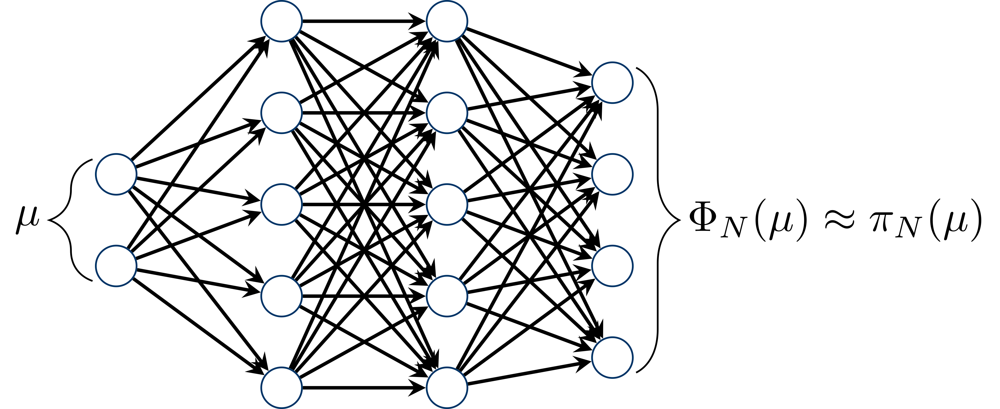
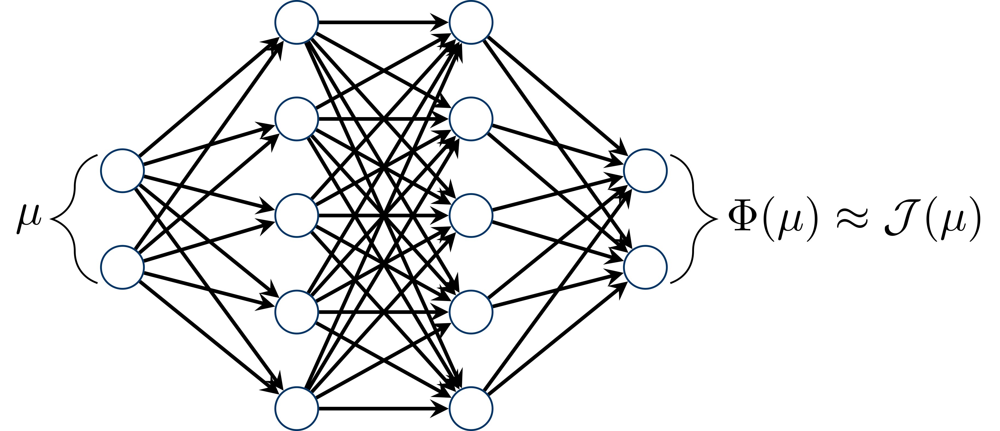
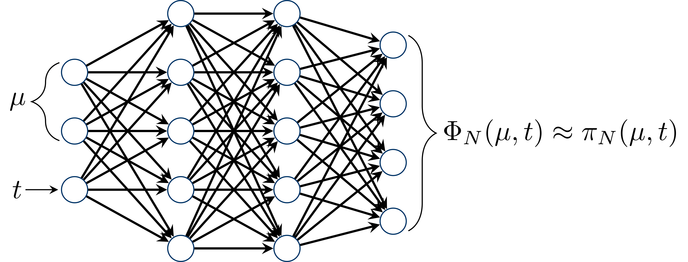
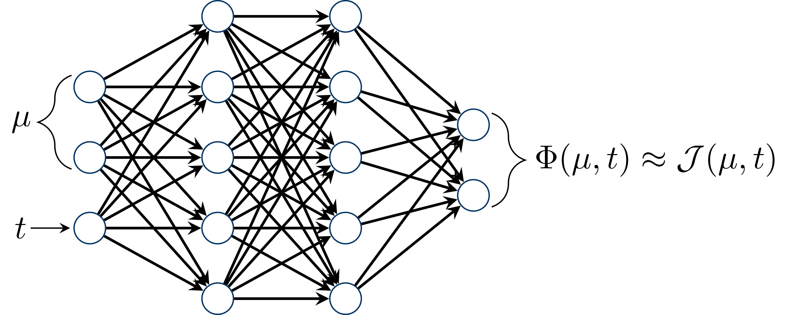

---
jupyter:
  jupytext:
    text_representation:
      extension: .md
      format_name: markdown
      format_version: '1.3'
      jupytext_version: 1.17.3
  kernelspec:
    display_name: Python 3 (ipykernel)
    language: python
    name: python3
---

<!-- #region slideshow={"slide_type": "slide"} -->
# Model Order Reduction with Artificial Neural Networks in pyMOR
<!-- #endregion -->

<!-- #region slideshow={"slide_type": "subslide"} -->
## Overview
- Application: Parametrized PDEs (stationary and instationary)
- Theory: Reduced Basis Methods, Proper Orthogonal Decomposition, Artifical Neural Networks
- Practice: Implementation in pyMOR
- **Important:** In order to used neural networks in pyMOR, you need to install PyTorch!
<!-- #endregion -->

<!-- #region slideshow={"slide_type": "slide"} -->
## A Non-Intrusive Reduced Order Method Using Artificial Neural Networks
<!-- #endregion -->

<!-- #region slideshow={"slide_type": "subslide"} -->
### Two scenarios:

1. Given a full-order model $\mu\mapsto u_h(\mu)$, but e.g. no affine decomposition of operators.
2. Given only a set $\{(\mu_i,u_h(\mu_i))\}_{i=1}^n\subset \mathcal{P}\times V_h$ of parameter values with corresponding snapshots.
<!-- #endregion -->

<!-- #region slideshow={"slide_type": "subslide"} -->
### The approach:

- Compute a reduced space $V_N$ with (orthonormal) basis $\Psi_N$ (for instance via POD using only snapshot data)
- Project full-order solution $u_h(\mu)$ onto $V_N$ (orthogonal projection!):
  $$
  \pi_N \colon \mathcal{P} \to \mathbb{R}^N, \qquad
  \pi_N(\mu) = \Psi_N^\top u_h(\mu)
  $$
- Function $\pi_N$ returns for a parameter $\mu\in\mathcal{P}$ the coefficients of the projection $u_N(\mu)=P_{V_N}(u_h(\mu))$ of $u_h(\mu)$ onto $V_N$ w.r.t. the basis $\Psi_N$
- Approximate the map $\pi_N$ by a neural network $\Phi_N$
<!-- #endregion -->

<!-- #region slideshow={"slide_type": "fragment"} -->
### Error estimate:

\begin{align}
    \lVert u_h(\mu)-\underbrace{\Psi_N\Phi_N(\mu)}_{\text{reconstruction of }\Phi_N(\mu)\text{ in }V_h}\rVert\leq\underbrace{\lVert u_h(\mu)-u_N(\mu)\rVert}_{\text{best-approximation error in }V_N} + \underbrace{\lVert\pi_N(\mu)-\Phi_N(\mu)\rVert}_{\text{approximation error of the neural network}}
\end{align}
<!-- #endregion -->

<!-- #region slideshow={"slide_type": "slide"} -->
## Available variants in pyMOR
<!-- #endregion -->

<!-- #region slideshow={"slide_type": "subslide"} -->
### Stationary, State approximation: $\mu\mapsto\pi_N(\mu)$


<!-- #endregion -->

<!-- #region slideshow={"slide_type": "subslide"} -->
### Stationary, Output approximation: $\mu\mapsto\mathcal{J}(\mu)$


<!-- #endregion -->

<!-- #region slideshow={"slide_type": "subslide"} -->
### Instationary, State approximation: $(\mu,t)\mapsto\pi_N(\mu,t)$


<!-- #endregion -->

<!-- #region slideshow={"slide_type": "subslide"} -->
### Instationary, Output approximation: $(\mu,t)\mapsto\mathcal{J}(\mu,t)$


<!-- #endregion -->

<!-- #region slideshow={"slide_type": "slide"} -->
## A Stationary Example in pyMOR
<!-- #endregion -->

<!-- #region slideshow={"slide_type": "subslide"} -->
### Setting up the problem:

Example problem:

$$
-\nabla \cdot \big(d(x, \mu) \nabla u(x, \mu) \big) = f(x, \mu), \quad x \in \Omega = (0, 1)^2,
$$

with data functions

$$
\begin{align}
  f((x_1, x_2), \mu) &= 10 \mu + 0.1, \\
  d((x_1, x_2), \mu) &= (1 - x_1) \mu + x_1,
\end{align}
$$

where $\mu \in (0.1, 1)$ denotes the parameter. Further, we apply the Dirichlet boundary conditions

$$
u((x_1, x_2), \mu) = 2 x_1 \mu + 0.5, \quad x = (x_1, x_2) \in \partial\Omega.
$$
<!-- #endregion -->

```python slideshow={"slide_type": "subslide"}
from pymor.basic import *

problem = StationaryProblem(
      domain=RectDomain(),

      rhs=LincombFunction(
          [ExpressionFunction('10', 2), ConstantFunction(1., 2)],
          [ProjectionParameterFunctional('mu'), 0.1]),

      diffusion=LincombFunction(
          [ExpressionFunction('1 - x[0]', 2), ExpressionFunction('x[0]', 2)],
          [ProjectionParameterFunctional('mu'), 1]),

      dirichlet_data=LincombFunction(
          [ExpressionFunction('2 * x[0]', 2), ConstantFunction(1., 2)],
          [ProjectionParameterFunctional('mu'), 0.5]),

      name='2DProblem'
  )

fom, _ = discretize_stationary_cg(problem, diameter=1/50)

parameter_space = fom.parameters.space((0.1, 1))
```

<!-- #region slideshow={"slide_type": "subslide"} -->
### Setting up the neural network reductor:
<!-- #endregion -->

```python slideshow={"slide_type": "-"}
training_parameters = parameter_space.sample_uniformly(100)
validation_parameters = parameter_space.sample_randomly(20)
```

If no `reduced_basis` is passed to the `NeuralNetworkReductor`, a basis is computed automatically using POD.

```python slideshow={"slide_type": "fragment"}
from pymor.reductors.neural_network import NeuralNetworkReductor

nn_reductor = NeuralNetworkReductor(fom=fom,
                                    training_parameters=training_parameters,
                                    validation_parameters=validation_parameters,
                                    l2_err=1e-5,  # POD error
                                    ann_mse=5e-5)  # Neural network training error
```

<!-- #region slideshow={"slide_type": "fragment"} -->
*Alternative, purely data-driven usage:* Pass pairs of parameters and solutions as training/validation set to the reductor and set `fom=None`.
<!-- #endregion -->

<!-- #region slideshow={"slide_type": "subslide"} -->
Let's look at the `reduce`-method of the `NeuralNetworkReductor` to see the options we have for customizing the neural network training:
<!-- #endregion -->

```python
nn_reductor.reduce?
```

<!-- #region slideshow={"slide_type": "subslide"} -->
Let's run the `reduce`-method of the `NeuralNetworkReductor`:
<!-- #endregion -->

```python
nn_rom = nn_reductor.reduce()
```

```python slideshow={"slide_type": "fragment"}
print(f'Reduced basis size: {len(nn_reductor.reduced_basis)}')
print(f'Neural network losses: {nn_reductor.losses}')
```

<!-- #region slideshow={"slide_type": "subslide"} -->
### Test of the ROM:
<!-- #endregion -->

```python slideshow={"slide_type": "-"}
mu = parameter_space.sample_randomly()

U = fom.solve(mu)
U_red = nn_rom.solve(mu)
U_red_recon = nn_reductor.reconstruct(U_red)

fom.visualize((U, U_red_recon, U-U_red_recon),
              legend=(f'Full solution for parameter {mu}',
                      f'Reduced solution for parameter {mu}',
                      f'Difference between solution and approximation'),
              separate_colorbars=True)
```

<!-- #region slideshow={"slide_type": "subslide"} -->
### Error and runtime comparison:
<!-- #endregion -->

```python slideshow={"slide_type": "-"}
test_set = parameter_space.sample_randomly(10)
```

```python slideshow={"slide_type": "fragment"}
import time
import numpy as np

def compute_average_errors_and_speedups(rom, reductor):
    U = fom.solution_space.empty(reserve=len(test_set))
    U_red = fom.solution_space.empty(reserve=len(test_set))

    speedups = []

    for mu in test_set:
        tic = time.perf_counter()
        U.append(fom.solve(mu))
        time_fom = time.perf_counter() - tic

        tic = time.perf_counter()
        U_red.append(reductor.reconstruct(rom.solve(mu)))
        time_red = time.perf_counter() - tic

        speedups.append(time_fom / time_red)

    absolute_errors = (U - U_red).norm()
    relative_errors = (U - U_red).norm() / U.norm()

    return np.average(absolute_errors), np.average(relative_errors), np.average(speedups)
```

<!-- #region slideshow={"slide_type": "subslide"} -->
Let us compute the errors on the test set:
<!-- #endregion -->

```python
avg_abs_err, avg_rel_err, avg_speedup = compute_average_errors_and_speedups(nn_rom, nn_reductor)

print(f'Average absolute error: {avg_abs_err}')
print(f'Average relative error: {avg_rel_err}')
print(f'Average speedup: {avg_speedup}')
```

<!-- #region slideshow={"slide_type": "slide"} -->
## Extending the problem by output quantities
<!-- #endregion -->

```python
problem = problem.with_(outputs=[('l2', problem.rhs), ('l2_boundary', problem.dirichlet_data)])
```

```python
fom, _ = discretize_stationary_cg(problem, diameter=1/50)
```

```python slideshow={"slide_type": "subslide"}
from pymor.reductors.neural_network import NeuralNetworkStatefreeOutputReductor

output_reductor = NeuralNetworkStatefreeOutputReductor(fom=fom,
                                                       training_parameters=training_parameters,
                                                       validation_parameters=validation_parameters,
                                                       validation_loss=1e-5)

output_rom = output_reductor.reduce(log_loss_frequency=2)
```

<!-- #region slideshow={"slide_type": "subslide"} -->
Adjust the error computations accordingly:
<!-- #endregion -->

```python
def compute_average_output_errors_and_speedups(rom):
    outputs = []
    outputs_red = []
    outputs_speedups = []

    for mu in test_set:
        tic = time.perf_counter()
        outputs.append(fom.output(mu=mu))
        time_fom = time.perf_counter() - tic

        tic = time.perf_counter()
        outputs_red.append(rom.output(mu=mu))
        time_red = time.perf_counter() - tic

        outputs_speedups.append(time_fom / time_red)

    outputs = np.squeeze(np.array(outputs))
    outputs_red = np.squeeze(np.array(outputs_red))

    outputs_absolute_errors = np.abs(outputs - outputs_red)
    outputs_relative_errors = np.abs(outputs - outputs_red) / np.abs(outputs)

    return np.average(outputs_absolute_errors), np.average(outputs_relative_errors), np.average(outputs_speedups)

output_avg_abs_err, output_avg_rel_err, output_avg_speedup = compute_average_output_errors_and_speedups(output_rom)
```

<!-- #region slideshow={"slide_type": "subslide"} -->
And we compute the actual errors in the output:
<!-- #endregion -->

```python
print(f'Average absolute error: {output_avg_abs_err}')
print(f'Average relative error: {output_avg_rel_err}')
print(f'Average speedup: {output_avg_speedup}')
```

<!-- #region slideshow={"slide_type": "subslide"} -->
## Summary

- pyMOR provides highly customizable training routines for neural networks with various options and parameters to tune
- Implementation respects abstract interfaces, i.e. the reductors can be directly applied to models/solutions originating from external solvers (see for instance https://github.com/pymor/pymor/blob/main/src/pymordemos/neural_networks_instationary.py for an example of Navier-Stokes equations using the FEniCS bindings in pyMOR)
- Applicable to stationary and instationary problems
- Different architecture called long short-term memory (LSTM) neural networks is also available for instationary problems (this architecture is closely related to time-stepping schemes)
<!-- #endregion -->

<!-- #region slideshow={"slide_type": "subslide"} -->
### Exercise (Revision of the `StationaryRBReductor` from the session on Monday; related to the state-reductor):

Set up a `StationaryRBReductor` for the FOM using the same reduced basis as built by the `NeuralNetworkReductor` (the reduced basis can be accessed via `nn_reductor.reduced_basis`) and compute a corresponding ROM. Compute the errors and speedups for the test set from above.
<!-- #endregion -->

```python slideshow={"slide_type": "-"}

```

### Exercise (related to the state-reductor):

Create two lists of tuples of parameters and corresponding solutions of the FOM - one for the training set and one for the validation set. Create a new `NeuralNetworkReductor` with these lists as inputs instead of a FOM (use `l2_err=1e-5` and `ann_mse=1e-5` as above). Call the `reduce`-method of the reductor (it might be necessary to increase the number of restarts to train a neural network that reaches the prescribed tolerance) and evaluate the performance of the ROM compared to the FOM.

```python

```

<!-- #region slideshow={"slide_type": "subslide"} -->
### Exercise (related to the output-reductor):

Set up a new `NeuralNetworkReductor` for the changed FOM (which now includes the output quantities) with the same tolerances. Use this new reductor to compute a ROM that also takes the output into account and compare the results on the test set with those from the `NeuralNetworkStatefreeOutputReductor`.
<!-- #endregion -->

```python

```

### Exercise:

Try the `NeuralNetworkReductor` also for instationary problems.
